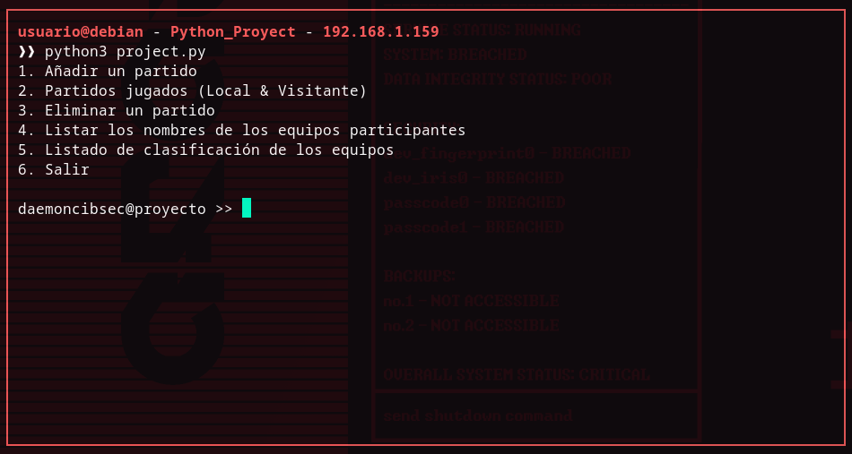

# Python_Project

## Overview / Descripción

This project is not related to cybersecurity, unlike what I'd like to aim this account to. I had to do this project so my professors can determine wether I obtain the knowledge they wanted us (me and my classmates) to acquire before ending this unit. Since I'm doing a System & Networks Administrarion course, so being able to manage data creating simple scripts is an obligatory requirement to achieve on the subject it's related to. Anyways, I decided to upload this project to GitHub so my classmates can have a reference to complete their project, and use this one as an example if anyone wants to.

Este proyecto no está relacionado con la ciberseguridad, en contraste a qué tenía planeado hacer con esta cuenta y sobre qué centrarla. Tuve que hacer este proyecto para que mis profesores puedan determinar si he adquirido (tanto yo como mis compañeros) los conocimientos que nos estaban brindando antes de acabar con la unidad. Al estar haciendo un curso de Administración en sistemas informáticos y redes, ser capaz de manejar datos a través de "scripts" simples es un requisito a cumplir en la asignatura sobre la que está relacionada. De todas formas, decidí subir este proyecto a GitHub para que mis compañeros puedan tener una referencia sobre la que inspirarse para completar sus proyectos, y usar este como ejemplo si alguien quiere.

## Setting up the script / Descargar y preparar el script

Requisites: Python >= 3.0

Requisitos: Python >= 3.0

```bash
git clone https://github.com/daemoncibsec/python_project.git
cd python_project/
```

## Starting the script / Ejecutar el script

```bash
python3 project.py
```

### How does it works? / ¿Cómo funciona?

The script acts on a file called "matches.txt" that contains soccer matches. This script allows you to add matches to the file, see how many times a team has played local or visitant, remove matches, list the names of the teams that have participated in any match, and list the ranking of the teams according to a specific amount of points (based on the number of games won or lost). The script reads the "partidos.txt" and/or writes on it (depending of the selected option in the menu) according to the data structure inside of it (CSV).

El script actúa sobre un fichero llamado "partidos.txt" que contiene partidos de fútbol. Este script parmite añadir partidos al fichero, ver cuántas veces ha jugado un equipo como local o como visitante, eliminar partidos, listar los nombres de los equipos que han participado, y listar la clasificación de los equipos según una cantidad específica de puntos (según la cantidad de partidos ganados o perdidos). El script lee el fichero "partidos.txt" y/o escribe sobre este (dependiendo de la opción seleccionada en el menú) respetando siempre la estructura del fichero (CSV).

## Preview / Demostración


